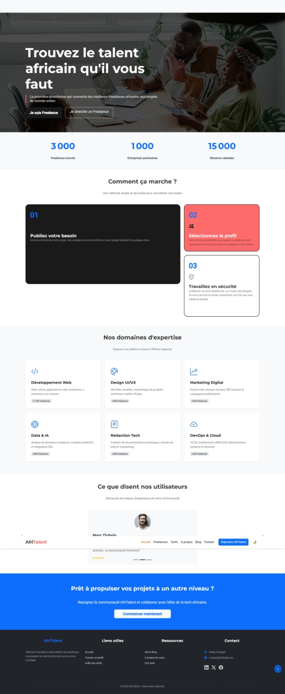

# AfriTalent
Projet fil rouge
## Description

AfriTalent est un site vitrine fictif présentant une plateforme de mise en relation entre freelances tech et entreprises en Afrique. Le site présente la plateforme, ses fonctionnalités, ses tarifs, des profils de freelances et vise à convaincre les visiteurs (freelances et entreprises) de s'inscrire. Il met en avant un design moderne inspiré des tendances web 2026 (Bento Grid, typographie expressive, animations au scroll).

## Auteur

- **Nom :** NDIAYE Soukeye Mara
- **Classe :** Licence 1 Data Science & Big Data

## Technologies utilisées

- **HTML5** — structure sémantique, accessibilité (alt, aria-label)
- **CSS3** — variables CSS, Flexbox, Grid, Bento Grid, animations, media queries, Google Fonts
- **Bootstrap 5** — navbar, cards, carousel, accordion, grille responsive
- **JavaScript vanilla** — manipulation du DOM, IntersectionObserver, localStorage, validation de formulaire
- **Bootstrap Icons**
- **Google Fonts** (Montserrat, Roboto)

## Fonctionnalités principales

- Navigation responsive avec dark mode persistant (localStorage)
- Navbar dynamique qui change de style au scroll
- Compteurs animés au scroll (IntersectionObserver)
- Animations fade-in à l'entrée des sections dans le viewport
- Filtrage dynamique des freelances par catégorie (sans rechargement de page)
- Validation de formulaire de contact en temps réel (regex email, longueur minimum, messages d'erreur personnalisés)
- Bouton "Retour en haut" avec scroll fluide
- Design en Bento Grid (page d'accueil et page À propos)

## Aperçu

## Démo en ligne

🔗 [Voir le site en ligne](https://mara06161-ux.github.io/NDIAYE-Soukeye-Mara-AfriTalent/)

## Lancer le projet en local

1. Cloner le dépôt :git clone https://github.com/mara06161-ux/NDIAYE-Soukeye-Mara-AfriTalent.git
2. Ouvrir `index.html` dans un navigateur (aucune installation requise)

## Ressources consultées

- [MDN Web Docs](https://developer.mozilla.org/fr/)
- [Bootstrap 5 Docs](https://getbootstrap.com/docs/5.3/)
- [Google Fonts](https://fonts.google.com/)
- [Bootstrap Icons](https://icons.getbootstrap.com/)
- [W3C Validator](https://validator.w3.org/)
- [Coolors](https://coolors.co/) — validation de la palette de couleurs
- [Pexels](https://www.pexels.com/) — images libres de droits